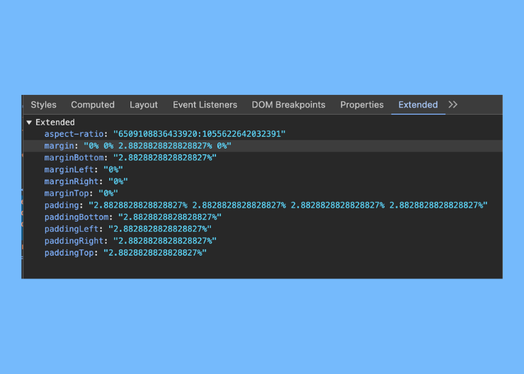

This extension was crafted by Starry Skadi - [kyawzayarwin.com](https://kyawzayarwin.com)

You see, Starry Skadi, he would like to use percentages for padding and margin. Why? Who knows. But here we are.

Before this, he had to endure this mind-numbing calculation every single time:

- Percentage Padding Width = (Static Padding Width / Element Content Width) × 100
- Percentage Padding Height = (Static Padding Height / Element Content Width) × 100

Imagine doing that repeatedly and not losing your mind. 

So, after getting thoroughly bored (and maybe a little angry at himself), he whipped up this extension. 

Problem solved. 

Now he can stop yelling at his calculator and get back to doing what he does - enjoy those extra minutes of sleep saved from all that math.

Now, it also supported `aspect-ratio`.